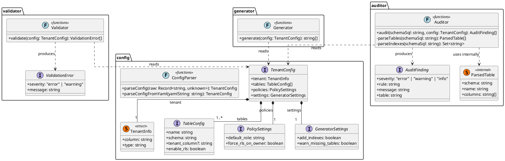
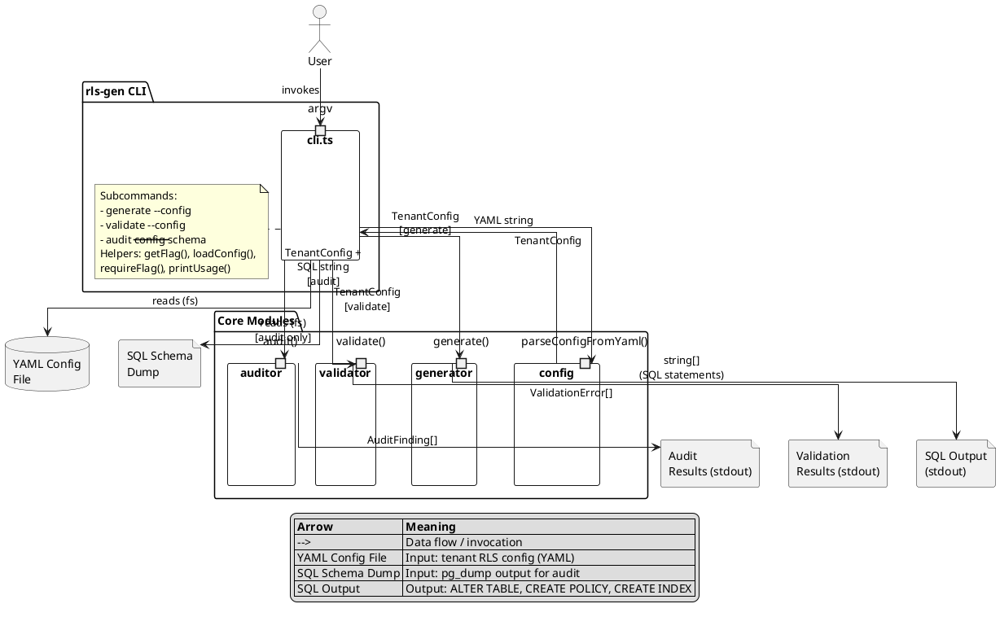

# rls-gen

Generate PostgreSQL Row-Level Security policies from a simple config file. Stop relying on `WHERE tenant_id = ?` scattered across your codebase and start enforcing tenant isolation where it actually matters — at the database level.

## The problem

Every multi-tenant app starts the same way: you add `tenant_id` to your tables and make sure every query filters by it. Then someone forgets. Or a new hire writes a reporting query without the filter. Or an ORM-generated join leaks rows. I've seen this happen across teams at different scales — 50 tenants, 5,000 tenants, doesn't matter. The bug is always the same: one tenant sees another tenant's data.

PostgreSQL's Row-Level Security fixes this at the right layer. But setting it up correctly is tedious and error-prone: you need to enable RLS on every table, write policies, remember `FORCE ROW LEVEL SECURITY` so table owners don't bypass it, add indexes so filtered queries don't tank performance, and keep all of this in sync as your schema evolves.

`rls-gen` takes a YAML config describing your tenant model and generates all the SQL you need. It also audits your existing schema to catch tables you forgot to cover.

## Install

```bash
npm install -g rls-gen
```

Or run directly:

```bash
npx rls-gen generate --config rls.yaml
```

## Usage

### 1. Define your tenant model

```yaml
tenant:
  column: tenant_id
  type: uuid

tables:
  - name: users
    schema: public
    enable_rls: true
  - name: orders
    schema: public
    enable_rls: true
  - name: audit_logs
    schema: public
    tenant_column: org_id # some tables use a different column
    enable_rls: true

policies:
  default_role: app_user
  force_rls_on_owner: true # don't let table owners bypass RLS

settings:
  add_indexes: true # generate indexes on tenant columns
  warn_missing_tables: true # flag tables missing from this config
```

### 2. Generate SQL

```bash
rls-gen generate --config rls.yaml
```

```sql
ALTER TABLE public.users ENABLE ROW LEVEL SECURITY;

ALTER TABLE public.users FORCE ROW LEVEL SECURITY;

CREATE POLICY tenant_isolation_users ON public.users
  TO app_user
  USING (tenant_id = current_setting('app.current_tenant')::uuid);

CREATE INDEX IF NOT EXISTS idx_users_tenant_id ON public.users(tenant_id);

-- ... repeated for each table
```

Pipe it into your migration tool, review it, apply it. The output is plain SQL — no lock-in.

### 3. Validate your config

```bash
rls-gen validate --config rls.yaml
```

Catches issues before you generate anything:

- Invalid column types (only `uuid`, `integer`, `bigint`, `text`)
- Duplicate table entries
- Missing required fields
- Tables with RLS disabled (warns you in case it's unintentional)

### 4. Audit your schema

```bash
pg_dump --schema-only mydb > schema.sql
rls-gen audit --config rls.yaml --schema schema.sql
```

```
[WARNING] missing-from-config    Table 'public.sessions' exists in schema but is not in the RLS config
[WARNING] inconsistent-tenant-column  Table 'audit_logs' uses 'org_id' instead of the default 'tenant_id'
[WARNING] missing-index           Table 'public.orders' has no index on tenant column 'tenant_id'
```

This is the command you run in CI after every migration. New table without RLS coverage? You'll know before it hits production.

## How RLS works with your app

For the generated policies to take effect, your app needs to set the current tenant on each connection:

```sql
SET app.current_tenant = 'a1b2c3d4-...';
```

Most connection pools support a setup hook for this. In Node with `pg`:

```typescript
const pool = new Pool({
  // ...
});

// set tenant context when acquiring a connection
pool.on("connect", (client) => {
  client.query(`SET app.current_tenant = '${tenantId}'`);
});
```

After that, every query on that connection is automatically scoped. No more forgotten WHERE clauses.

## Config reference

| Field                          | Required | Default                  | Description                                           |
| ------------------------------ | -------- | ------------------------ | ----------------------------------------------------- |
| `tenant.column`                | yes      | —                        | Default tenant column name across tables              |
| `tenant.type`                  | yes      | —                        | PostgreSQL type (`uuid`, `integer`, `bigint`, `text`) |
| `tables[].name`                | yes      | —                        | Table name                                            |
| `tables[].schema`              | no       | `public`                 | PostgreSQL schema                                     |
| `tables[].tenant_column`       | no       | inherits `tenant.column` | Override tenant column for this table                 |
| `tables[].enable_rls`          | no       | `true`                   | Whether to generate RLS for this table                |
| `policies.default_role`        | no       | `app_user`               | PostgreSQL role the policy applies to                 |
| `policies.force_rls_on_owner`  | no       | `false`                  | Also enforce RLS on table owners                      |
| `settings.add_indexes`         | no       | `false`                  | Generate `CREATE INDEX` for tenant columns            |
| `settings.warn_missing_tables` | no       | `false`                  | Flag schema tables missing from config during audit   |

## Architecture

```
src/
├── config/       # YAML parsing, defaults, config validation
├── generator/    # SQL statement generation from config
├── validator/    # Config correctness checks (pre-generation)
├── auditor/      # Schema-vs-config gap detection (post-generation)
└── cli.ts        # Three commands: generate, validate, audit
```

### Class Diagram



### Component Diagram



Intentional design choices:

- **Validator vs Auditor are separate concerns.** Validation checks your config in isolation (is it well-formed?). Auditing compares your config against a live schema dump (is it complete?). You can validate without a database, but you need a schema dump to audit.
- **Regex-based schema parsing.** The auditor parses `CREATE TABLE` statements with targeted regexes against `pg_dump` output. A full SQL parser would be more robust but adds a heavy dependency for something that runs against a predictable format.
- **Single runtime dependency** (`yaml`). Everything else is standard library. The CLI is hand-rolled from `process.argv` — no framework overhead for three simple commands.

See [docs/adr/](docs/adr/) for the full decision records.

## Development

```bash
git clone https://github.com/elliot736/rls-gen.git
cd rls-gen
npm install
npm test        # 42 specs across 4 modules
npm run build
```

Tests are spec-driven and table-driven, covering every module independently. No database required to run them.

## Contributing

Open an issue first if you're planning something non-trivial. Small fixes and typo corrections are welcome as direct PRs. PRs should include tests — write them before the implementation.

## License

MIT
